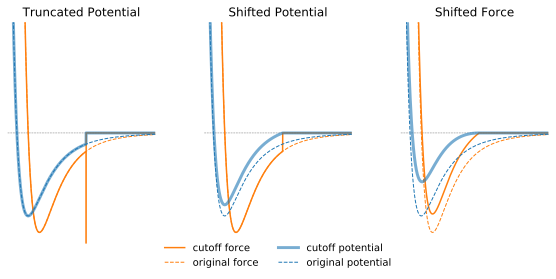

The most computationally demanding part of a molecular dynamics simulation is the calculation of the nonbonded terms of the potential energy function. As non-bonded energy terms between every pair of atoms should be evaluated, the number of calculations increases as the square of the number of atoms. To speed up the computation, only the interactions between two atoms separated by a distance less than a pre-defined cutoff distance are evaluated.

## Neighbour Searching Methods
 The search for pairs of particles that are needed for calculation of the short-range nonbonded interactions is usually accelerated by maintaining a list of all particles within a predefined cutoff distance of each other.  Particle neighbours are determined either by dividing the simulation system into grid cells (cell lists) or by constructing a neighbour list for each particle (Verlet lists).

### Cell Lists
The cell lists method divides the simulation domain into *n* cells within edge length greater or equal to the cutoff radius of the interaction to be computed.  The interaction potential for each particle is then computed as the sum of the pairwise interactions between the particle and all other particles in the same cell and all other particles in the neighbouring cells (26 cells for 3-dimensional simulation).

### Verlet Lists
A Verlet list stores all particles within the cutoff distance of every particle plus some extra buffer distance. Although all pairwise distances must be evaluated to construct the Verlet list, it can be used for several consecutive time steps until any particle has moved more than half of the buffer distance. At this point the list is invalidated and the new list must be constructed. Verlet offer more efficient computation of pairwise interactions at the expence of relatively large memory requirement which can be a limiting factor. In practice, almost all simulations are run in parallel and use a combination of spatial decomposition and Verlet lists.

## Truncation of Lennard-Jones Interactions

The LJ potential is always truncated at the cutoff distance.

 How to choose the appropriate cutoff distance? A common practice is to truncate at 2.5 $$\sigma$$ and this practice has become a minimum standard for truncation.  At this distance, the LJ potential is about 1/60 of the well depth $$\epsilon$$ and it is assumed that errors arising from this truncation are small enough. The dependence of the cutoff on $$\sigma$$ means that the choice of the cutoff distance depends on the force field and atom types used in the simulation. For example for the O, N, C, S, and P atoms in the AMBER99 force field the values of $$\sigma$$ are in the range 1.7-2.1,  while for the Cs ions  $$\sigma=3.4$$. Thus the minimum acceptable cutoff, in this case, is 8.5.

In practice, increasing cutoff does not necessarily improve accuracy. Each force field has been developed using a certain cutoff value, and effects of the truncation were compensated by adjustment of some other parameters. If you use cutoff 14 for the force field developed with the cutoff 9, then you cannot say that you used this forcefield. Thus to ensure consistency and reproducibility of simulation you should choose the cutoff appropriate for the force field.

> ## Cutoffs Used for Development of Common Force Fields
> AMBER: 9 &#8491;
>
> CHARMM: 12 &#8491;
>
> GROMOS: 14 &#8491;
>
> OPLS: 11-15 &#8491; (depending on a molecule size)
{: .callout}

## Problems with Cutoff and How to Avoid Them
A cutoff introduces discontinuity in the potential energy at the cutoff value. The forces are computed by differentiating potential, hence a sharp difference in potential may result in an infinite forces at the cutoff distance, Figure 1A.

Several approaches to minimize impact of the cutoff exist. The standard solution is to shift the whole potential uniformly by subtracting a constant at a values below cutoff (shifted potential method, Figure 1B).This ensures continuity of the potential at cutoff distance and avoids an infinite forces here. Addition of a constant term does not change forces at the distances below cutoff because it disappears when the potential is differentiated. However, it introduces a discontinuity in the force at the cutoff distance. Particles will experience sudden unphysical acceleration when other particles cross their respective cutoff distance. The total potential energy changes when potential is shifted.

Shifted Force
Communication: Shifted forces in molecular dynamics
J. Chem. Phys. 134, 081102 (2011); https://doi.org/10.1063/1.3558787

Our results show that different molecular properties are affected differently by the various approximations. The extent to which these approximations can be tolerated thus depends in part on the questions the simulations are intended to answer. We find that short cutoffs or the use of the force-shifting truncating (SHIFT) approximation have the effect of subtly shifting the balance between hydrophobic and hydrophilic interactions such that more compact structures are stabilized.
[Effect of potential truncations and shifts on the solid-liquid phase coexistence of Lennard-Jones fluids]

http://localhost:4000/reference.html#Ahmed-2010

The net effect is a steady increase in the temperature of the system over time.

a prudent practice is to carry out trial simulations of the system under study--without temperature scaling--in order to assess the relative accuracy of the trajectory under the particular simulation conditions to be used for production runs

carefully testing the new-RF set for energy leaks or sources before production use

An alternative approach for dealing with trun- cation effects is to alter the form of the potential function in a zone at the cutoff boundary so that the potential and its first derivative (the force) go to zero smoothly at the cutoff. The application of
a smoothing function leads to much more stable trajectories in simulations of liquids.4’13 The smoothing procedure does not affect the short range liquid structure and has a very small effect on the internal energy, but it does have a large effect on the long range orientational order. As the long range orientational order is related to the dielectric response of the liquid, the use of a smoothing function will, in general, alter the dielectric properties of the liquid.~

Another solution is to apply a switching function (usually polynomial) to truncate the non-bonded interaction smoothly at the cutoff distance. If the switching function is applied the switching parameter specifies the distance at which the switching function starts to modify the LJ potential to bring it to zero at the cutoff distance.

Cutoff problems are especially pronounced when energy conservation is required.

Thermodynamic quantities depending explicitly on the free energy are generally quite sensitive to how large is the cutoff.

 Examples include the location of the critical point, the surface tension, and the solid–liquid coexistence line [(Ahmed, 2010)]({{ page.root }}/reference.html#Ahmed-2010). For such quantities even a cutoff at 2.5 $$ \sigma $$ gives inaccurate results, and in some cases the cutoff must be larger than 6 $$ \Sigma $$ to get reliable results.

> ## Specifying Truncation of LJ Potential in GROMACS
> **vdw-modifier** Controls how to truncate LJ potential. Acceptable values:
> >**potential-shift** Shifts the Van der Waals potential by a constant such that it is zero at the **rvdw**.
>>
>>**force-switch** Smoothly switches the forces to zero between **rvdw-switch** and **rvdw**.
>>
>> **potential-switch** Smoothly switches the potential to zero between **rvdw-switch** and **rvdw**.
>>
>>**none**
>
> **rvdw-switch** Where to start switching.
>
> **rvdw**
> Cut-off distance
{: .callout}
> ## Specifying Truncation of LJ Potential in NAMD
> **cutoff** Cut-off distance common to both electrostatic and van der Waals calculations
>
> **switching** Turn switching on/off
>
> **switchdist** Where to start switching
>
> **vdwForceSwitching** Use force switching for VDW
>> Default Value: off
{: .callout}

## Truncation of the Electrostatic Interactions
Electrostatic interactions occurring over long distances are known to be important for biological molecules. Electrostatic interactions decay slowly and simple increase of the cutoff distance to account for long-range interactions can dramatically raise the computational cost. In periodic simulation systems, the most commonly used method for calculation of long-range electrostatic interactions is particle-mesh Ewald.  In this method, the electrostatic interaction is divided into two parts: a short-range contribution, and a long-range contribution. The short-range contribution is calculated by exact summation of all pairwise interactions of atoms separated by a distance that is less than cutoff in real space. The forces beyond the cutoff radius are approximated in Fourier space commonly by the Particle-Mesh Ewald (PME) method.

> ## Specifying Cutoff and Neighbour Searching Methods in GROMACS
> **cutoff-scheme**
> Since version 5.1 **group** list has been deprecated and only **Verlet** scheme is available
>
> **rlist**
> Cutoff distance for the short-range neighbour list. Active when **verlet-buffer-tolerance** = -1, otherwise ignored
>
> **verlet-buffer-tolerance**
> The maximum allowed error for pair interactions per particle caused by the Verlet buffer. To achieve the predefined tolerance the cutoff distance **rlist** is adjusted indirectly. To override this feature set the value to -1
>
>> Default value: 0.005 [kJ mol-1 ps-1]
>
>**nstlist**
> Frequency to update the neighbour list. If set to 0 the neighbour list is constructed only once and never updated.
>
>> Default Value: 10
>
>**ns-type**
> Neighbour search method. Acceptable values:
>> **grid**: make a grid in the box and only check atoms in neighboring grid cells.
>>
>> **simple**: loop over every atom in the box.
{: .callout}

> ## Specifying Cutoff and Neighbour Searching Methods in NAMD
> When run in parallel NAMD uses a combination of spatial decomposition into grid cells, "patches" and Verlet lists with extended cutoff distance
>
> **cutoff**
> Local interaction distance. Same for both electrostatic and VDW interactions
>
> **pairlistdist**
> Distance between pairs for inclusion in pair lists. Should be bigger or equal than the **cutoff**.
>
>> Default value: **cutoff**
>
> **stepspercycle**
> Number of timesteps in each cycle. Each cycle represents the number of timesteps between atom reassignments.
>> Default Value: 20
>
>**pairlistsPerCycle**
> Specifies how many times per cycle to regenerate pairlists.
>> Default value: 2
{: .callout}
