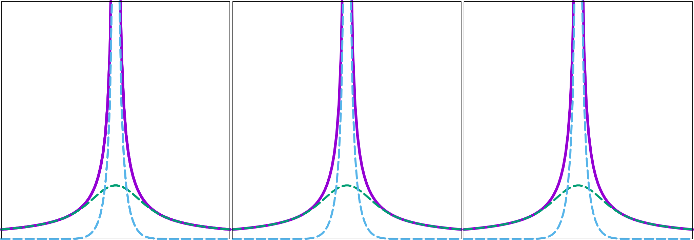

Due to the long-range behavior of Coulomb interactions, the task of computing Coulomb potentials is often the most time consuming part of any MD simulation.  Therefore, fast and efficient algorithms are required to accelerate these calculations.

Particle Mesh Ewald (PME) method is the most widely used method using the Ewald decomposition technique, the potential is divided into two parts; a real space part (computed in real space) and a Fourier space part (computed in Fourier space). The real space sum is short-ranged and as for the LJ potentials, it can be truncated when sufficiently decayed. It is a direct sum of contributions from all particles within a cutoff radius. It is the Particle part of PME.

The Fourier space part, on the other hand, is long-ranged but smooth and periodic. This part is a slowly varying function. PME takes advantage of the fact that all periodic functions can be represented with a sum of sine or cosine components, and slowly varying functions can be accurately described by only a limited number of low frequency components (k vectors). In other words Fourier transform of the long-range Coulomb interaction decays rapidly in Fourier space, and summation converges fast.    

{:width="480"}

The long range contribution can then be efficiently computed in Fourier space using FFT. Fourier transform calculation is discrete and requires the input data to be on a regular grid. It is the  Mesh part of PME. As point charges in a simulation are non-equispaced, they need to be interpolated to obtain charge values in equispaced grid cells. 

Parameters controlling PME calculations are listed in the Table below.

| Variable \ MD package | GROMACS                  | NAMD                      | AMBER                  |
|-----------------------|--------------------------|---------------------------|------------------------|
| Fourier grid spacing  | fourierspacing (1.2)     | PMEGridSpacing  (1.5)     |                        |
| Grid Dimension X      | fourier-nx               | PMEGridSizeX              |  nfft1                 |
| Grid Dimension Y      | fourier-ny               | PMEGridSizeY              |  nfft2                 |
| Grid Dimension Z      | fourier-nz               | PMEGridSizeZ              |  nfft3                 |
| Direct space tolerance| ewald-rtol ($$10^{-5}$$) | PMETolerance ($$10^{-5}$$)| dsum_tol ($$10^{-6}$$) |
| Interpolaton order    | pme-order (4)            | PMEInterpOrder (4)        | order (4)              |

**Grid dimension** values give the size of the charge grid (upon which the reciprocal sums are interpolated) in each dimension. Higher values lead to higher accuracy (when the direct space tolerance is also lowered) but considerably slow the calculation. Generally it has been found that reasonable results are obtained when grid dimension values are approximately equal to periodic box size, leading to a grid spacing of 1.0 Å. Significant performance enhancement in the calculation of the fast Fourier transform is obtained by having each of the values be a product of powers of 2, 3, and/or 5.  If the values are not given, programs will chose values to meet these criteria.

**Interpolation order** is the order of the B-spline interpolation. The higher the order, the better the accuracy (unless the charge grid is too coarse). The minimum order is 3. An order of 4 (the default) implies a cubic spline approximation which is a good standard value.  
