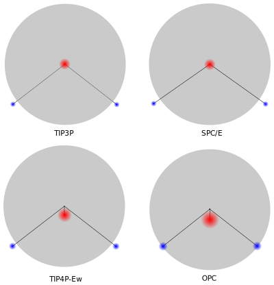
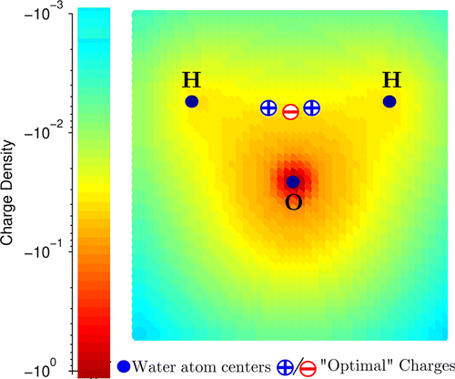
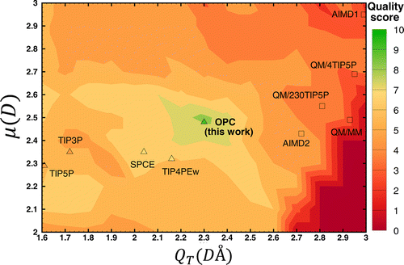

### Introduction

The goal of bio-molecular simulations is the accurate and predictive computer simulation of the physical properties of biological molecules in their aqueous environments. There are three main issues regarding the treatment of water in such simulations. 

1. The first is the accurate description of the protein–water interaction. While continuum models have shown some promise, they cannot reproduce the microscopic details of the protein–water interface. Consequently, most bio-molecular simulations are carried out with the solute surrounded by a droplet or periodic box of explicit water molecules. 

2. In a typical case, water molecules will account for over 80% of the particles in the simulation. Water–water interactions dominate the computational cost of such simulations, so the model used to describe the water needs to be fast as well as accurate

3. The third major issue is that proteins and nucleic acids are typically highly charged. This means that long-range Coulombic interactions need to be properly accounted for

Water models are empirical models focused on reproducing a number of properties in a particular phase. For example, some models reproduce well protein hydration energies, while others predict excellent water structure but not so good for hydration free energy. Most importantly, none of water models accurately reproduce all of the key properties of bulk water simultaneously. Inaccuracies of water models can adversely affect simulations in an unpredictable manner. 

Thus, in choosing a water model for use in a molecular simulation, the desired properties of interest must be planned because it will determine which water model would be optimal for the simulation.

Water molecules have OH distance of 0.9572 $$ \unicode{x212B} $$ and HOH angle of 104.52°. Early water models used a rigid geometry closely matching that of actual water molecules. To achieve this O-H and H-H distances are constrained with harmonic potential. 

Point charges in classical water models replace electron density distribution. They are meant to reproduce the electrostatic potential of a molecule. Therefore, they are usually derived by fitting to the electrostatic potential around a water molecule. There are some downsides for this approach, which we will discuss later. 

#### How to assess quality of a water model?
A good water model must faithfully reproduce six bulk properties of water:
- Static dielectric constant, $$ \epsilon_{0} $$
- Self diffusion coefficient, $$ \vec{D} $$
- Heat of vaporization, $$ \Delta{H}_{vap} $$
- Isobaric heat capacity, $$ \vec{C}_{p} $$
- Thermal expansion coefficient, $$ \alpha_{p} $$
- Isothermal compressibility, $$ \kappa_{T} $$

Several water models with different level of complexity (the number of interaction points) have been developed. We will discuss only the models most widely used in simulations, and refer you to the excellent [article in Wikipedia](https://en.wikipedia.org/wiki/Water_model) for an overview of all water models.

#### Force Field Parameters of the common Water Models

|     | TIP3P  | SPC/E   | TIP4P-Ew | OPC    |
|---  |--------|---------|----------|--------|
|OH   | 0.9572 | 1.0     | 0.9572   | 0.8724 |
|HH   | 1.5136 | 1.63    | 1.5136   | 1.3712 | 
|HOH  | 104.52 | 109.47  | 104.52   | 103.6  |
|OM   | -      |  -      | 0.125    | 0.1594 |
|A(12)| 582.0  |629.4    | 656.1    | 865.1  |
|B(6) | 595.0  |625.5    | 653.5    | 858.1  |
|qO   | −0.834 | −0.8476 | −1.04844 | −1.3582|
|qH   | +0.417 | +0.4238 | +0.52422 | +0.6791|

{: width="600"}

#### 3-point models: TIP3P (transferable intermolecular potential) and SPC/E  (simple point-charge)
These models have three interaction points corresponding to the atoms of the water molecule. Only oxygen atom has the Lennard-Jones parameters. While TIP3P uses a rigid geometry matching that of actual water molecules, SPC model uses more acute tetrahedral angle of 109.47°. 3-site models are commonly used because computationally they are highly efficient.

#### 4-point: TIP4P-Ew and OPC (optimal point-charge)    
In these models the negative charge is not centered on the oxygen atom, but shifted towards hydrogen atoms. This position is represented with the fourth dummy atom (EP) located near the oxygen along the bisector of the HOH angle. 

A key challenge in developing water models is to find an accurate yet simplified description of the charge distribution of the water molecule that can adequately account for the hydrogen bonding in the liquid phase.

As we have seen before there are accuracy problems with all water models. For example,
- TIP5P predicts excellent water structure, but poor hydration energies. 
- TIP3P model predicts hydration free energies of small neutral molecules more accurately than the TIP4PEw model.
- Early water models were developed with cut-off of electrostatic interactions. Using these models with full electrostatic method results in stronger electrostatic interactions and conequently higher density.

The last and the latest water models we will look at is the OPC (Optimal Point Charges). It belongs to the family of 3 charge, 4 point models. The key difference from the previous models is that it was designed without geometrical restraints. This design approach is based on the observation that QM electrostatic potential of water molecule is reproduced considerably more accurately with 3 point charges when they form tight cluster of the point charges away from the nuclei than the more traditional distribution with point charges placed on or near the nuclei.

- Removing point charge positioning restrictions allowed for considerably better reproduction of the six bulk properties of water.

Let's have a look at the quality scores of different water models summarized in the figure below. The figure shows how quality score depends on the dipole and quadrupole moments. Interestingly the test models in which the moments were close to the QM values had low quality. And the models that scored better had moments very different from the QM vaules. This indicates that three point charges, even if placed optimally, are not enough to represent the complex charge distribution of real water molecule to the needed degree of accuracy. 

Figures from the reference [[Building Water Models: A Different Approach](https://pubs.acs.org/doi/abs/10.1021/jz501780a)] 

#### Performance Considerations
The time to compute inteactions between a pair of water molecules is approximately proportional to the number of distances between each pair of interaction points. For the 3-point model, 9 distances are required for each pair of water molecules. For the 4-site model, 10 distances are required (every charged site with every charged site, plus the VDW O–O interaction).

#### Other things to consider
Water models in common use in bio-molecular simulation have traditionally only been parameterized for a single temperature of 298K (SPC/E, TIP3P)
 

1. [Structure and Dynamics of the TIP3P, SPC, and SPC/E Water Models at 298 K](https://pubs.acs.org/doi/full/10.1021/jp003020w)
2. [Building Water Models: A Different Approach](https://pubs.acs.org/doi/abs/10.1021/jz501780a)
