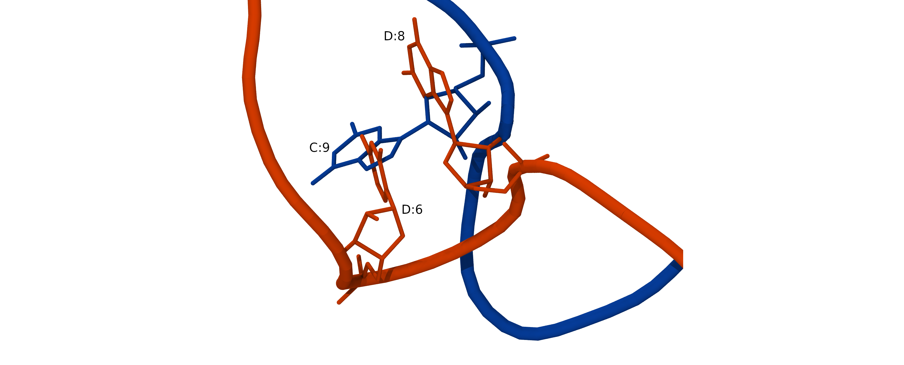
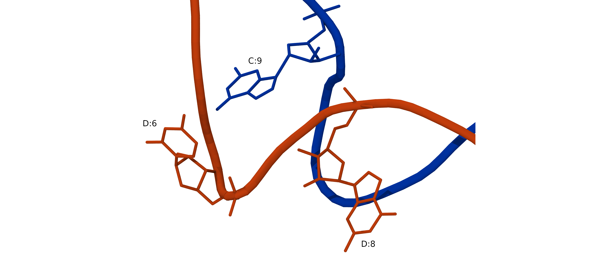

## Introduction
In this lesson, we will prepare simulation of a complex of human argonaute-2 (hAgo2) protein with a micro RNA bound to a target messenger RNA ([PDBID:6N4O](https://www.rcsb.org/structure/6n4o)).

Micro RNAs (miRNAs) are short non-coding RNAs that are critical for regulating gene expression and the defense against viruses. miRNAs regulate a wide variety of human genes. They can control the production of proteins by targeting and inhibiting mRNAs. miRNAs can specifically regulate individual protein's expression, and their selectivity is based on sequence complementarity between miRNAs and mRNAs. miRNAs that target messenger RNAs (mRNAs) encoding oncoproteins can serve as selective tumor suppressors. They can inhibit tumor cells without a negative impact on all other types of cells. The discovery of this function of miRNAs has made miRNAs attractive tools for new therapeutic approaches. However, it is challenging to identify the most efficient miRNAs that can be targeted for medicinal purposes. To regulate protein synthesis miRNAs interact with hAgo2 protein forming the RNA-induced silencing complex that recognizes and inhibits the target mRNAs by slicing them. Therefore, elucidating the structural basis of the molecular recognition between hAgo2 and mRNA is crucial for understanding miRNA functions and developing new therapeutics for diseases.

Create working directory:
~~~
mkdir ~/scratch/workshop/pdb/6N4O
cd ~/scratch/workshop/pdb/6N4O
~~~
{: .bash}

## 1. Preparing a protein for molecular dynamics simulations.
### 1.1 Adding missing residues to protein structure files.
#### 1.1.1 What residues are missing?
Almost all protein and nucleic acid crystallographic structure files are missing some residues. The reason for this is that the most flexible parts of biopolymers are disordered in crystals, and if they are disordered the  electron density will be weak and fuzzy and thus atomic coordinates cannot be accurately determined. These  disordered atoms, however, may be crucial for MD simulations (e.g., loops connecting functional domains, nucleic acid chains, incomplete amino acid side chains ... etc.). For realistic simulation, we need to build a model containing all atoms.

How can we find out if any residues are missing in a PDB file? Missing residues, and other useful information is available in PDB file REMARKS. There are many types of REMARKS. The REMARK 465 lists the residues that are present in the SEQRES records but are completely absent from the coordinates section. You can find information about all types of REMARKS [here](https://www.wwpdb.org/documentation/file-format-content/format32/remarks2.html).

Let's see if our PDB file is missing any residues
~~~
grep "REMARK 465" ../6n4o.pdb | less
~~~
{: .bash}
~~~
REMARK 465 MISSING RESIDUES
REMARK 465 THE FOLLOWING RESIDUES WERE NOT LOCATED IN THE
REMARK 465 EXPERIMENT. (M=MODEL NUMBER; RES=RESIDUE NAME; C=CHAIN
REMARK 465 IDENTIFIER; SSSEQ=SEQUENCE NUMBER; I=INSERTION CODE.)
REMARK 465
REMARK 465   M RES C SSSEQI
REMARK 465     MET A     1
REMARK 465     TYR A     2
REMARK 465     SER A     3
REMARK 465     GLY A     4
REMARK 465     ALA A     5
REMARK 465     GLY A     6
REMARK 465     PRO A     7
...
~~~
{: .output}

Yes, there is a bunch of missing residues, and we need to insert them to complete the model. One way to do this is to use homology modeling servers. Let's use the SWISS-MODEL server.

##### 1.1.2 Prepare a structural template and a sequence of the complete protein.

To add missing residues we need to supply a structure file with missing protein residues and a sequence of the complete protein. Let's prepare these two required files.

Download structure and sequence files from PDB database:
~~~
wget https://files.rcsb.org/download/6n4o.pdb
wget https://www.rcsb.org/fasta/entry/6N4O/download -O 6n4o.fasta
~~~
{: .bash}

Examine visually the file "6n4o.fasta". There are sequences for 3 chains (A,C,D), each printed in one line. We will need a separate sequence file for each chain. Extract the complete sequences of the protein (chain A), and of the RNA (chains C,D). We will need them later. Can we use grep? We used grep to find a pattern in a file and print out the line containing this sequence. Can we ask grep to print the next line as well? Yes, there is an option -A for this!
~~~
grep -A1 "Chain A" 6n4o.fasta > 6n4o_chain_A.fasta
grep -A1 "Chain C" 6n4o.fasta > 6n4o_chain_C.fasta
grep -A1 "Chain D" 6n4o.fasta > 6n4o_chain_D.fasta
~~~
{: .bash}

Use grep manual to see the meaning of the -A option.

Extract chain A from 6n4o.pdb using VMD
~~~
module load StdEnv/2020 gcc vmd
vmd
~~~
{: .bash}

In the VMD console, execute the following commands:
~~~
mol new 6n4o.pdb
set sel [atomselect top "chain A"]
$sel writepdb 6n4o_chain_A.pdb
quit
~~~
{: .vmd}

##### 1.1.3 Adding missing residues using the SWISS-MODEL server
Download 6n4o_chain_A.pdb and 6n4o_chain_A.fasta to your computer for homology modeling with SWISS-MODEL. You can do it with the scp program from your local computer:

- In a browser on your local computer navigate to [SWISS-MODEL](https://swissmodel.expasy.org) website.
- Click Start Modelling,
- Click User Template,
- Paste the full sequence of your protein or upload 6n4o_chain_A.fasta,
- Upload your structure file 6n4o_chain_A.pdb missing residues,
- Click Build Model

The workshop data already has this protein model in the directory "workshop/pdb/6N4O/protein_models".

 > ## Are all missing residues added?
 > This protein model is in the directory "pdb/6N4O/protein_models", in the file 6N4O_SWISS_PROT_model_chainA.pdb. How many residues should the complete model have? How many residues are in the file?
 >> ## Solution
 >> The complete Ago-2 protein has 859 residue, the model has 838. The first 21 residues are missing.  
 >  {: .solution}
 {: .challenge}
 
##### 1.1.4 Adding missing residues using the i-TASSER server
The limitation of SWISS-MODEL server is that it is not capable of modeling long terminal fragments. Another homology modeling server [i-TASSER](https://zhanglab.ccmb.med.umich.edu/I-TASSER/) (Iterative Threading ASSEmbly Refinement) uses the advanced protocol and is capable of predicting folding without any structural input. The downside of i-TASSER is that the process is much longer (about 60 hours for protein like 6n4o). We can not wait for i-TASSER modeling to complete, but the result is available in the workshop data tarball. 
Another drawback is that i-TASSER optimizes, positions of all atoms, which is great, but not always desirable. 

#### 1.2. Aligning protein models.
i-TASSER modeling procedure changes the orientation of the protein and slightly optimizes the positions of all atoms. We want keep the original atom positions, and only add the model of the N-terminal end. To combine the i-TASSER model with the actual 6n4o coordinates, we need to align the i-TASSER model with the original structure.

It is often very useful to align several structures for comparison. However, if a structure that you want to compare with the reference has a different number of residues or some deletions/insertions it is not straightforward to do an alignment. You will need to prepare two lists of structurally equivalent atoms.  

We have two models of out protein in the directory.

~~~
cd ~/scratch/workshop/pdb/6N4O/protein_models
ls *model*
~~~
{: .bash}

~~~
6N4O_i-TASSER_model_chainA.pdb  6N4O_SWISS_PROT_model_chainA.pdb
~~~
{: .output}

For alignment we want to use only the real data, the residues that are resolved in the crystallographic structure and are given in the PDB entry 6N4O. Let's print out the list of missing residues again:
~~~
grep "REMARK 465" ../6n4o.pdb | less
~~~
{: .bash}

Using this information we can compile a list of all residues that have coordinates. We will need this list for several purposes, such as alignment of protein molecules and constraining them during energy minimization and energy equilibration.

To begin the alignment process start VMD and load two pdb files. They will be loaded as molecules 0 and 1, respectively:
~~~
mol new 6N4O_SWISS_PROT_model_chainA.pdb
mol new 6N4O_i-TASSER_model_chainA.pdb
~~~
{: .vmd}

Define the the variable *6n4o_residues* containing the list of all residues present in 6N4O.pdb:
~~~
set 6n4o_residues "22 to 120 126 to 185 190 to 246 251 to 272 276 to 295 303 to 819 838 to 858"
~~~
{: .vmd}
Select residues defined in the variable *6n4o_residues* from both models, and save selections in the variables *swissmodel* and *itasser*. We have now two sets of equivalent atoms.
~~~
set swissmodel [atomselect 0 "backbone and resid $6n4o_residues"]
set itasser [atomselect 1 "backbone and resid $6n4o_residues"]
~~~
{: .vmd}

Now we need to find a rigid body transformation from itasser to swissmodel. The *measure* VMD command can compute the transformation matrix. It can measure lot of other useful things, such as rmsd, surface area, hydrogen bonds, energy and much more. And of course it can do it for each frame of a trajectory. You can get help on all options by typing "measure" in VND console.
 
Compute the transformation (rotation + translation 4;3) matrix *TransMat*.
~~~
set TransMat [measure fit $itasser $swissmodel]
~~~
{: .vmd}
The matrix describes how to move itasser atoms so that they overlap the corresponding swissmodel atom. Once the matrix is computed all we need to do is to appy it to the whole itasser model. 

Select all residues of molecule 1 and apply the transformation to the selection.
~~~
echo rmsd before fit = [measure rmsd $itasser $swissmodel]
set itasser_all [atomselect 1 "all"]
$itasser_all move $TransMat
echo rmsd after fit = [measure rmsd $itasser $swissmodel]
~~~
{: .vmd}
Select residues 1-21 from molecule 1 and save them in the file 6n4o_resid_1-21.pdb
~~~
set term [atomselect 1 "noh resid 1 to 21"]
$term writepdb 6n4o_resid_1-21.pdb
quit
~~~
{: .vmd}
Combine the i-TASSER model of residues 1-21 with the SWISS-MODEL.
~~~
grep -h ATOM 6n4o_resid_1-21.pdb 6N4O_SWISS_PROT_model_chainA.pdb > 6n4o_chain_A_complete.pdb
~~~
{: .bash}

#### 1.3. Mutating residues
PDB entry 6N4O is the structure of the catalytically inactive hAgo2 mutant D669A. To construct the active form, we need to revert this mutation. Let's use *pdb4amber* utility to mutate ALA669 to ASP:
~~~
pdb4amber -i 6n4o_chain_A_complete.pdb -o 6n4o_chain_A_complete_A669D.pdb -m "669-ALA,669-ASP" 
~~~
{: .bash}

Verify the result:
~~~
grep 'A 669' 6n4o_chain_A_complete_A669D.pdb
~~~
{: .bash}

~~~
ATOM   5305  N   ASP A 669     -19.332  25.617 -27.862  1.00  0.97         N  
ATOM   5306  CA  ASP A 669     -18.951  24.227 -27.916  1.00  0.97         C  
ATOM   5307  C   ASP A 669     -17.435  24.057 -28.043  1.00  0.97         C  
ATOM   5308  O   ASP A 669     -16.661  25.018 -28.091  1.00  0.97         O  
~~~
{: .output}

This works, but it is not very smart because the program simply renames ALA to ASP and deletes all atoms except the 4 backbone atoms. While leap will rebuild the sidechain, it will not ensure that it is added in the optimal conformation. You can do a better job manually if you preserve all common atoms. Many types of mutations are different only in 1-2 atoms.

>## Mutating residues with stream editor
>Mutate ALA669 to ASP669 using stream editor (sed), and keeping all common atoms.
>>## Solution
>>To mutate ALA669 to ASP669, we need to delete from ALA669 all atoms that are not present in ASP. Then change the residue name of ALA to ASP. Let's begin by checking what atoms are present in residue 669:
>>~~~
>>grep 'A 669' 6n4o_chain_A_complete.pdb
>>~~~
>>{: .bash}
>>~~~
>>ATOM   5161  N   ALA A 669     -19.332  25.617 -27.862  1.00  0.97       N
>>ATOM   5162  CA  ALA A 669     -18.951  24.227 -27.916  1.00  0.97       C
>>ATOM   5163  C   ALA A 669     -17.435  24.057 -28.043  1.00  0.97       C
>>ATOM   5164  O   ALA A 669     -16.661  25.018 -28.091  1.00  0.97       O
>>ATOM   5165  CB  ALA A 669     -19.720  23.530 -29.053  1.00  0.97       C
>>~~~
>>{: .output}
>>
>>If you are familiar with aminoacid structures, you remember that the alanine sidechain is made of only one beta carbon atom (CB). All amino acids except glycine have beta carbon as well. So there is nothing to delete. All we need to do is to change the resName of all five ALA atoms to ASP.
You can do it using stream editor:
>>~~~
>>sed 's/ALA A 669/ASP A 669/g' 6n4o_chain_A_complete.pdb > 6n4o_chain_A_complete_A669D.pdb
>>~~~
>>{: .bash}
>>
>>Verify the result:
>>~~~
>>grep 'A 669' 6n4o_chain_A_complete_A669D.pdb
>>~~~
>>{: .bash}
>>
>>~~~
>>ATOM   5161  N   ASP A 669     -19.332  25.617 -27.862  1.00  0.97       N
>>ATOM   5162  CA  ASP A 669     -18.951  24.227 -27.916  1.00  0.97       C
>>ATOM   5163  C   ASP A 669     -17.435  24.057 -28.043  1.00  0.97       C
>>ATOM   5164  O   ASP A 669     -16.661  25.018 -28.091  1.00  0.97       O
>>ATOM   5165  CB  ASP A 669     -19.720  23.530 -29.053  1.00  0.97       C
>>~~~
>>{: .output}
>{: .solution}
{: .challenge}

The check_structure utility will do mutation with minimal atom replacement. It will also complete sidechain and check it for clashes. If modeller suite is installed it can also relax added sidechains.
~~~
source ~/env-biobb/bin/activate
check_structure -i 6n4o_chain_A_complete.pdb -o 6n4o_chain_A_complete_A669D.pdb mutateside --mut ala669asp  
~~~
{: .bash}

Verify the result:
~~~
grep 'A 669' 6n4o_chain_A_complete_A669D.pdb
~~~
{: .bash}

>## Adding functionally important ions.
>The catalytic site of hAgo2 is comprised of the four amino acids D597, E637, D669 and H807. It is known that hAgo2 requires a divalent metal ion near the catalytic site to slice mRNA. The 6n4o PDB file does not have this ion, but another hAgo2 structure, 4w5o, does. 
>
>Align 4w5o with 6n4o and save all MG ions in the file "4w5o_MG_ions.pdb" so that we will be able to add them later to our simulation. For alignment use the catalytic site residues D597, E637, D669 and H807.
>
>> ## Solution
>>Download 4w5o.pdb
>>~~~
>>cd ~/scratch/workshop/pdb/6N4O/protein_models
>>wget https://files.rcsb.org/download/4w5o.pdb
>>mv 4w5o.pdb ../
>>~~~
>>{: .bash}
>>Align 4w5o with 6n4o, renumber and save MG ions.
>>~~~
>>mol new ../6n4o.pdb
>>mol new ../4w5o.pdb
>>set 6n4o [atomselect 0 "backbone and resid 597 637 669 807"]
>>set 4w5o [atomselect 1 "backbone and resid 597 637 669 807"]
>>set TransMat [measure fit $4w5o $6n4o]
>>echo rmsd before fit = [measure rmsd $6n4o $4w5o]
>>set 4w5o_all [atomselect 1 "all"]
>>$4w5o_all move $TransMat
>>echo rmsd after fit = [measure rmsd $6n4o $4w5o]
>>set mg [atomselect 1 "resname MG"]
>>$mg set resid [$mg get residue]
>>$mg writepdb 4w5o_MG_ions.pdb
>>quit
>>~~~
>>{: .vmd}
>{: .solution}
{: .challenge}

### 2. Adding missing segments to RNA structure files.
Inspection of the PDB file 6n4o shows that several nucleotides are missing in both RNA chains. The RNA model must be completed, and all RNA atoms placed at the appropriate positions before we can start simulations the system.

First, we need to create a PDB file containing all RNA atoms. At this initial step, we are not particularly concerned with the quality of the 3D structure because we will refine it later.

We can insert the missing residues using the freely available [ModeRNA server](http://iimcb.genesilico.pl/modernaserver/submit/model/) or standalone ModeRNA software. The automatic process used by ModeRNA server moves residues adjacent to the inserted fragment. Changing atomic positions is not desirable because we want to keep all experimental coordinates. Besides, modeRNA server offers a limited set of options, and the output PDB files will need more processing to make them usable in the simulation. For these reasons, we will use the standalone modeRNA package. ModeRNA software is available on CC systems. If you are comfortable with installation of Python, you can install it on your computer as well.

#### 2.1. Using modeRNA on CC systems.
ModeRNA is a python module. To install it we need to create a python virtual environment, and the install ModeRNA modue into the environment. 
~~~
module load StdEnv/2016.4 python/2.7.14
virtualenv ~/env-moderna
source ~/env-moderna/bin/activate
pip install numpy==1.11.3 biopython==1.58 ModeRNA==1.7.1
~~~
{: .bash}

Installation is required only once. When you login into your account next time you only need to activate the environment:
~~~
module load StdEnv/2016.4 python/2.7.14
source ~/env-moderna/bin/activate
~~~
{: .bash}

Once you install modeRNA program, you will be able to use all its functions. As modeRNA inserts missing fragments only into a single RNA strand, we need to model chains C and D separately. For insertion of missing residues we need to prepare anstructural template and a sequence alignment file for each RNA strand.

#### 2.2. Preparing a structural template for chains C and D.
Let's go into the directory where we will be working with RNA models.
~~~
mkdir ~/scratch/workshop/pdb/6N4O/RNA_models/modeRNA
cd ~/scratch/workshop/pdb/6N4O/RNA_models/modeRNA
~~~
{: .bash}

To make a structural template we will prepare a pdb file containing only RNA from 6n4o.pdb. One file containing both RNA chains (C and D) is sufficient.

~~~
module load StdEnv/2020 gcc vmd
vmd
~~~
{: .bash}

~~~
mol new ../../6n4o.pdb
set sel [atomselect top "chain C or (chain D and not resid 6)"]
$sel writepdb 6n4o_chains_CD.pdb
quit
~~~
{: .vmd}

Because residue 6 in chain D has only phosphate atoms it cannot be used as a template, so we remove it.

We created the file 6n4o_chains_CD.pdb suitable for use as a structural template. Next, we need to prepare sequence alignment files for chains C and D. These files describe a sequence of the model to be built and a sequence matching the structural template where the missing residues to be inserted are represented with '-'.  

#### 2.4. Preparing sequence alignment files for chains C and D.

What residues are missing?
~~~
grep "REMARK 465" ../6n4o.pdb 
~~~
{: .bash}
~~~
...                                            
REMARK 465       A C    10                                                      
REMARK 465       U C    19                                                      
REMARK 465       U D     7                                                      
REMARK 465       C D     8                                                      
REMARK 465       A D    17                                                      
REMARK 465       A D    18     
~~~
{: .output}

Copy RNA fasta files into the current directory (~/scratch/workshop/pdb/6N4O/RNA_models/modeRNA)
~~~
cp ../../6n4o_chain_C.fasta ../../6n4o_chain_D.fasta . 
~~~
{: .bash}

Use a text editor of your choice (for example, nano or vi) to edit these two sequence alignment files. Each file must contain two sequences, the sequence of the model to be built and the template sequence matching the structural template. The contents of the files is shown below.

Sequence alignment file for chain C:
~~~
cat 6n4o_chain_C.fasta
~~~
{: .bash}
~~~
>Model
UGGAGUGUGACAAUGGUGUUU
>Template
UGGAGUGUG-CAAUGGUG-UU
 ~~~
{: .output}

Sequence alignment file for chain D:
~~~
cat 6n4o_chain_D.fasta
~~~
{: .bash}
~~~
>Model
CCAUUGUCACACUCCAAA
>Template
CCAUU---ACACUCCA--
~~~
{: .output}

#### 2.5. Inserting missing segments.
Below are the commands needed to insert missing fragments in chains C and D.  The detailed description of all modeRNA commands is available [here](http://genesilico.pl/moderna/commands/).

~~~
from moderna import *
# Model chain C
tC = load_template('6n4o_chains_CD.pdb', 'C')  # template C
aC = load_alignment('6n4o_chain_C.fasta')      # alignment C
mC = create_model(model_chain_name = 'A')      # model C
apply_alignment(tC, aC, mC)
apply_indel(mC, '9', '11', 'A')  # insert A between 9 and 11
apply_indel(mC, '18', '20', 'U') # insert U between 18 and 20
renumber_chain(mC, '1')
write_model(mC, 'chain_C_model_A.pdb')
# Model chain D
tD = load_template('6n4o_chains_CD.pdb', 'D')
aD = load_alignment('6n4o_chain_D.fasta')
mD = create_model(model_chain_name = 'B')
apply_alignment(tD, aD, mD)
apply_indel(mD, '5', '9', 'GUC')
apply_missing_ends(aD, mD)
renumber_chain(mD, '1')
write_model(mD, 'chain_D_model_B.pdb')
~~~
{: .python}

Start python and execute the commands interactively:
~~~
module --force purge
module load StdEnv/2016.4 python/2.7.14
source ~/env-moderna/bin/activate
python
~~~
{: .bash}
Or save these commands in the file make_models.py and run it non-iteractively.

The modeRNA program will create two model files, chain_C_model_A.pdb, and chain_D_model_B.pdb. Ensure that the program added all missing residues and did not move any residues present in the original structure file.

> ## How will ModeRNA server do the same task?
> Try using ModeRNA server. Compare automatically generated ModeRNA models with the original chains C and D.
> Did server only add missing residues without moving any other atoms?
> Can you spot any other pitfalls with the automatically generated models?
>> ## Solution 
>>ModeRNA server inserts missing residues with the same residue number as the residue before insertion. It uses an insertion code (iCode) to mark inserted residues. For example, if residues 6-8 are missing, the program will insert them as residues 5A, 5B, and 5C. It is not possible to instruct ModeRNA webserver to renumber residues, and it is not possible to change chainID either. So you will need to take care of residue numbering and renaming chains manually.
>>
>{: .solution}
{: .challenge}

**References:**
1. [ModeRNA: a tool for comparative modeling of RNA 3D structure](https://doi.org/10.1093/nar/gkq1320)

### 3. Optimizing double stranded RNA.
As we built two complementary RNA strands independently of each other, they clash when two strands are combined.

To resolve steric clashes and obtain a good initial RNA structure, we need to optimize the whole RNA duplex. We will use a Monte-Carlo based simulation program SimRNA. It is available as [SimRNAweb server](http://iimcb.genesilico.pl/modernaserver/submit/model/) or standalone  [SimRNA software](https://genesilico.pl/SimRNAweb). This program allows for RNA 3D structure modeling with optional restraints.

SimRNA features:
- Coarse-grained representation (5 atoms per residue)
- Monte Carlo method for sampling the conformational space
- The energy function is composed of statistical potential terms, derived from the observed frequencies of occurrence of various proximate structural patterns.

#### 3.1. Download and unpack SimRNA binary package:
Simulation submitted to public SimRNAweb server may wait up to a few days in the queue, while on a local computer, you can do it in a couple of minutes. SimRNA is available as a binary distribution, so no installation is required. You only need to download and unpack the package:

~~~
mkdir ~/scratch/workshop/pdb/6N4O/RNA_models/simRNA
cd ~
wget https://ftp.users.genesilico.pl/software/simrna/version_3.20/SimRNA_64bitIntel_Linux.tgz --no-check-certificate
tar -xf SimRNA_64bitIntel_Linux.tgz
cd ~/scratch/workshop/pdb/6N4O/RNA_models/simRNA
~~~
{: .bash}

>## Preparing input files for simulation with SimRNAweb server.
>If you will be using standalone SimRNA program you can skip this section and proceed to the next one.
>
>SimRNAweb server requires RNA sequence, a list of residues not allowed to move in simulation, and RNA structure in PDB format.
>
>RNA sequence:
>~~~
>UGGAGUGUGACAAUGGUGUUU CCAUUGUCACACUCCAAA
>~~~
>{: .string}
>
>A list of residues not allowed to move (we don't want the program to move atoms resolved in the experimental structure).
>~~~
> A:1-9,11-18,20-21;B:1-5,9-16
>~~~
>{: .string}
>PDB file matching the sequence. All atoms must be present, and chains must be named A and B. To prepare this file combine the model of chain C, the 5' phosphate from chain_D_model_B5P.pdb, and the model of chain D. Change the residue name to C5 and chain ID to B for the phosphate atoms.
>
>~~~
>cat chain_C_model_A.pdb > chains_CD_model_AB.pdb
>head -n 4 chain_D_model_B5P.pdb | sed 's/C5   /  C B/g' >> \
>chains_CD_model_AB.pdb
>cat chain_D_model_B.pdb >> chains_CD_model_AB.pdb
>~~~
>{: .bash}
{: .callout}

#### 3.2. Preparing a simulation with a standalone version of SimRNA.
For simulation with SimRNA you will need to modify the PDB structure file. Command-line SimRNA program does not take a list of frozen atoms as a separate input. Instead, you need to give this information in the occupancy field of the PDB structure file. But before we flag frozen atoms the missing phosphate must be added to the 5' terminal residue of chain D.

We begin with merging models of chains A and B if you have not done this yet:
~~~
mkdir ~/scratch/workshop/pdb/6N4O/RNA_models/simRNA
cd ~/scratch/workshop/pdb/6N4O/RNA_models/simRNA
cat ../modeRNA/chain_C_model_A.pdb ../modeRNA/chain_D_model_B.pdb > chains_CD_model_AB.pdb
~~~
{: .bash}

Next, we apply two modifications to this file. First, we need to add phosphate to the 5' terminal residue of chain D. SimRNA expects all residues to have a P atom. SimRNAweb will add P automatically, but for simulation with a standalone SimRNA program, we need to do it manually. There are several options to add the phosphate.

##### 3.2.1. Renaming O5' atom to P
The most straightforward fix is to rename O5' atom to P. if you chose to do this, save the edited file chains_CD_model_AB.pdb as chains_CD_model_AB_5P.pdb, and skip the next step.

##### 3.2.2. Adding 5' monophosphate with AmberTools/20.
First, rename the phosphorylated 5' terminal nucleotide C according to AMBER convention to C5. The names of phosphorylated terminals in AMBER are A5, C5, G5, U5, DA5, DC5, DG5, and DT5. The libraries of phosphorylated 5' terminal nucleotides are in the file '$AMBERHOME/dat/leap/lib/terminal_monophosphate.lib'.

~~~
module load StdEnv/2020 gcc/9.3.0 openmpi/4.0.3 ambertools/20
source $EBROOTAMBERTOOLS/amber.sh
~~~
{: .bash}

Launch Leap and load RNA force field:
~~~
tleap -f leaprc.RNA.OL3 -I $EBROOTAMBERTOOLS/dat/leap/lib/
~~~
{: .bash}
In the Leap promt execute the commands:
~~~
loadoff terminal_monophosphate.lib
chainD = loadpdb chain_D_model_B.pdb
savepdb chainD chain_D_model_B5P.pdb
quit
~~~
{: .leap}
These commands will load libraries of phosphorylated 5' terminal nucleotides and chain D PDB file. Leap will automatically add all missing atoms based on library entries and save chainD in the PDB file chain_D5P.pdb:

We don't want to use the PDB file prepared with Leap for SimRNA because AMBER has different aminoacid naming conventions. So we copy phosphate atoms from chain_D5P.pdb and paste them into chains_CD_model_AB.pdb. We then edit chain ID, residue ID, and residue name. Save the edited file chains_CD_model_AB.pdb as chains_CD_model_AB_5P.pdb

##### 3.2.3. Adding 5' mono-phosphate with [CHARMM-GUI](http://www.charmm-gui.org/?doc=input/pdbreader).
You can also add phosphate using CHARMM-GUI. Beware that CHARMM-GUI changes residue names to the old-style RNA 3-letter names and changes chain ID to "R".

##### 3.2.4 Define frozen atoms.
Standalone SimRNA program accepts PDB file where frozen atoms have occupancy 0.0 and completely free have occupancy 1.0. You can change values of the occupancy with the following VMD commands:

~~~
module --force purge
module load StdEnv/2020 gcc vmd
vmd
~~~
{: .bash}
~~~
mol new chains_CD_model_AB_5P.pdb
set sel [atomselect top all]
$sel set occupancy 0
set sel [atomselect top "chain A and resid 10 19"]
$sel set occupancy 1
set sel [atomselect top "chain B and resid 6 7 8 17 18"]
$sel set occupancy 1
set sel [atomselect top all]
$sel writepdb chains_CD_model_AB_5P_frozen.pdb
quit
~~~
{: .vmd}

#### 3.3. Running simulation
SimRNA needs two files in the working directory: 
- *chains_CD_model_AB_5P_frozen.pdb*, pdb file with flagged frozen atoms 
- *config*, the file with SimRNA simulation parameters.

Example configuration file:
~~~
NUMBER_OF_ITERATIONS 1000000
TRA_WRITE_IN_EVERY_N_ITERATIONS 10000
INIT_TEMP 1.35
FINAL_TEMP 0.90

BONDS_WEIGHT 1.0
ANGLES_WEIGHT 1.0
TORS_ANGLES_WEIGHT 0.0
ETA_THETA_WEIGHT 0.40
~~~
{: .string}

In the working directory, make a symbolic link to the 'data' directory located in SimRNA distribution. Assuming that you installed SimRNA in $HOME the link command is:
~~~
cd ~/scratch/workshop/pdb/6N4O/RNA_models/simRNA
ln -s ~/SimRNA_64bitIntel_Linux/data data
~~~
{: .bash}
Then run the simulation:
~~~
srun -c2 --mem-per-cpu=1000 --time=30:0 \
~/SimRNA_64bitIntel_Linux/SimRNA \
-P chains_CD_model_AB_5P_frozen.pdb \
-c config -E 2
~~~
{: .bash}

The option -E \<number of replicas> turns on replica exchange mode.
Replica exchange mode is parallelized with OMP. Each replica simulation can run on its own CPU independently of others,  so for the optimal performance allocate the same number of cores (option -c) as the number of replicas (option -E).

The simulation will run for about two minutes and produce trajectory file *.trafl for each replica.

#### 3.4. Processing simulation trajectory
The simplest way of processing the trajectory files is obtaining the lowest energy structure. Generally, better results can be obtained by using clustering. Clustering tool is included with the distribution, but using clustering is outside the scope of this workshop.

Extract the lowest energy frame from the trajectory of the first replica
~~~
~/SimRNA_64bitIntel_Linux/trafl_extract_lowestE_frame.py \
chains_CD_model_AB_5P_frozen.pdb_01.trafl
~~~
{: .bash}
Convert the lowest energy frame to PDB format
~~~
~/SimRNA_64bitIntel_Linux/SimRNA_trafl2pdbs chains_CD_model_AB_5P.pdb \
chains_CD_model_AB_5P_frozen.pdb_01_minE.trafl 1 AA
~~~
{: .bash}
This command will create PDB file of the lowest energy structure from trajectory of replica 1:
chains_CD_model_AB_5P_frozen.pdb_01_minE-000001_AA.pdb
We will use this relaxed structure for simulation. Rename it into a shorter name, for example chains_CD_minimized.pdb

~~~
cp chains_CD_model_AB_5P_frozen.pdb_01_minE-000001_AA.pdb chains_CD_minimized.pdb
~~~
{: .bash}

**References**
1. [SimRNA: a coarse-grained method for RNA folding simulations and 3D structure prediction](https://doi.org/10.1093/nar/gkv1479)
2. [SimRNA manual](https://ftp.users.genesilico.pl/software/simrna/version_3.20/SimRNA_UserManual_v3_20_20141002.pdf)
3. [VMD TCL commands](https://www.ks.uiuc.edu/Research/vmd/vmd-1.9.4/ug/node121.html)

### 4. Preparing simulation system for molecular dynamics.

#### 4.1 Determine the number of water and salt molecules needed to prepare solvated system.
To prepare solution with the desired ionic strength we will use SLTCAP server. For this calculation we need to know the molecular weight of the macromolecules, their charge, and the number of water molecules in the simulation system.

The molecular weight of hAgo2 is 97,208 Da, and the MW of our nucleic acids is 12.5 KDa [[calculate MW of the RNA]](http://www.encorbio.com/protocols/Nuc-MW.htm). Thus, the total MW is 110 KDa.

To determine the number of water molecules we will solvate the system in a cubic box extending 13 A from the solute.

~~~
mkdir -p ~/scratch/workshop/pdb/6N4O/simulation/setup
cd ~/scratch/workshop/pdb/6N4O/simulation/setup
cp ~/scratch/workshop/pdb/6N4O/protein_models/6n4o_chain_A_complete_A669D.pdb .
cp ~/scratch/workshop/pdb/6N4O/protein_models/4w5o_MG_ions.pdb .
cp ~/scratch/workshop/pdb/6N4O/RNA_models/simRNA/chains_CD_minimized.pdb .
~~~
{: .bash}

Launch Leap and load protein and RNA forcefields:
~~~
module --force purge
module load StdEnv/2020  gcc ambertools
source $EBROOTAMBERTOOLS/amber.sh
tleap -f leaprc.RNA.OL3 -f leaprc.protein.ff14SB -f leaprc.water.tip3p -I $EBROOTAMBERTOOLS/dat/leap/lib/
~~~
{: .bash}

Load pdb files into leap, combine them, and solvate the system
~~~
loadoff terminal_monophosphate.lib
rna = loadpdb chains_CD_minimized.pdb
prot = loadpdb 6n4o_chain_A_complete_A669D.pdb
mg = loadpdb 4w5o_MG_ions.pdb
sys = combine {prot,rna,mg}
solvatebox sys TIP3PBOX 13 iso
charge sys
quit
~~~
{: .leap}

~~~
 Solute vdw bounding box:              110.734 72.027 85.780
  Total bounding box for atom centers:  136.734 136.734 136.734
      (box expansion for 'iso' is  70.6%)
  Solvent unit box:                     18.774 18.774 18.774
  Volume: 2740120.355 A^3 
  Total mass 1460910.325 amu,  Density 0.885 g/cc
  Added 74991 residues.
> charge sys
Total unperturbed charge:  -6.000000
Total perturbed charge:    -6.000000
~~~
{: .output}

Using this information (MW 110 KDa, charge -6.0, 75000 water molecules) as an input to [*SLTCAP*](https://www.phys.ksu.edu/personal/schmit/SLTCAP/SLTCAP.html) server we obtain the number of ions: 188 anions and 194 cations.

>## Determine protonation states of titratable sites in the model complex.
>Use H++ server to determine what titratable sites in the model of protein-RNA complex 6n4o are in non-standard protonation state at pH 7?
>
>>## Solution
>>For processing with H++ server we need to merge models of protein, nucleic acids and MG ions into one PDB file. As H++ server does not have library entries for phosphorylated 5' terminals remove all 5' phosphate atoms.
>>
>>~~~
>>module load StdEnv/2020 gcc ambertools
>>source $EBROOTAMBERTOOLS/amber.sh
>>mkdir -p ~/scratch/workshop/pdb/6N4O/simulation/setup/Hpp
>>cd ~/scratch/workshop/pdb/6N4O/simulation/setup/Hpp
>>tleap -I $EBROOTAMBERTOOLS/dat/leap/lib/
>>~~~
>>{: .bash}
>>
>>~~~
>>source leaprc.RNA.OL3
>>source leaprc.protein.ff14SB
>>source leaprc.water.tip3p
>>loadoff terminal_monophosphate.lib
>>rna=loadpdb ../chains_CD_minimized.pdb
>>remove rna rna.1@P
>>remove rna rna.1@OP1
>>remove rna rna.1@OP2
>>remove rna rna.1@OP3
>>remove rna rna.1@HP3
>>remove rna rna.22@P
>>remove rna rna.22@OP1
>>remove rna rna.22@OP2
>>remove rna rna.22@OP3
>>remove rna rna.22@HP3
>>prot=loadpdb ../6n4o_chain_A_complete_A669D.pdb
>>mg=loadpdb ../4w5o_MG_ions.pdb
>>sys=combine {prot rna mg}
>>savepdb sys 6n4o_Hpp.pdb
>>quit
>>~~~
>>{: .leap}
>>
>>Process 6n4o_Hpp.pdb with H++ server.  
>>**Uncheck 'Correct orientation'** in the calculation setup.  
>>When calculation completes download the list of computed pKs (0.15_80_10_pH6.5_6n4o_Hpp.pkout)
>>
>>Examine the pK_(1/2) column for HIS, ASP, GLU.
>>~~~
>>grep ^HI 0.15_80_10_pH6.5_6n4o_Hpp.pkout
>>grep ^AS 0.15_80_10_pH6.5_6n4o_Hpp.pkout
>>grep ^GL 0.15_80_10_pH6.5_6n4o_Hpp.pkout
>>~~~
>>Histidines 77, 766, 822, and 829 are protonated (HIP)
>{: .solution}
{: .challenge}

#### 4.2 Preparing the complete simulation system

Finally, we have all pieces, and are ready to prepare the complete simulation system:
1. The protein model, 6n4o_chain_A_complete_A669D.pdb
2. The nucleic model, chains_CD_minimized.pdb
3.  Magnesium ions 4w5o_MG_ions.pdb
4.  We need to add 188 Na+ and 188 Cl- ions
5.  We need to protonate HIS 77, 766, 822, and 829

~~~
module load StdEnv/2020  gcc ambertools
source $EBROOTAMBERTOOLS/amber.sh
cd ~/scratch/workshop/pdb/6N4O/simulation/setup
tleap -I $EBROOTAMBERTOOLS/dat/leap/lib/ 
~~~
{: .bash}

~~~
source leaprc.RNA.OL3
source leaprc.protein.ff14SB
source leaprc.water.tip3p
loadamberparams frcmod.phos_nucleic14SB
loadoff terminal_monophosphate.lib
rna = loadpdb chains_CD_minimized.pdb
prot = loadpdb 6n4o_chain_A_complete_A669D.pdb
mg = loadpdb 4w5o_MG_ions.pdb
sys = combine {prot,rna,mg}
set {sys.77 sys.766 sys.822 sys.829} name "HIP"
addions sys Na+ 0
savepdb sys inpcrd_noWAT.pdb
solvatebox sys TIP3PBOX 13 iso
addionsrand sys Na+ 188 Cl- 188
saveamberparm sys prmtop.parm7 inpcrd.rst7
savepdb sys inpcrd.pdb
quit
~~~
{: .leap}

~~~
mv inpcrd.pdb inpcrd.rst7 prmtop.parm7 ../
~~~

The force field modification frcmod.phos_nucleic14SB is needed for simulation stability. It modifies AMBER parm10 set for 5' terminal phosphate in nucleic acids, The values are taken from frcmod.phosaa14SB 

> ## Write a shell script reproducing all system preparation steps
>We can run all leap commands interactively, but it would be convenient to have a single shell script that could reproduce all system preparation step when executed. How can we do it?
>
>Leap was designed to read commands from a file (-f option). It does not support input from STDIN, so we can not use pipeline to send commands to its input. This is inconvenient because we need two scripts to prepare a simulation: one with leap commands, and another with commands to run leap itself. Fortunately, shell is very flexible, and we can eliminate two-file workflow by using a special command allowing to use a variable instead of file as an input. 
>
>Inside of the script create a multi line variable containing all commands:
> ~~~
> var=$(cat << EOF
> ...
> ...
> EOF)
> ~~~
> Then pass this variable to leap using the `<(echo "$var")` command instead of filename. This command will allow leap to read the output of the command `echo "$var"` instead of the input filename .
>>## Solution
>>~~~
>>#!/bin/bash
>># FILE <<< prep_system.sh >>>
>>module --force purge
>>module load StdEnv/2020 gcc ambertools
>>source $EBROOTAMBERTOOLS/amber.sh
>>
>>inputData=$(cat << EOF
>>loadamberparams frcmod.phos_nucleic14SB
>>loadoff terminal_monophosphate.lib
>>rna = loadpdb chains_CD_minimized.pdb
>>prot = loadpdb 6n4o_chain_A_complete_A669D.pdb
>>mg = loadpdb 4w5o_MG_ions.pdb
>>sys = combine {prot,rna,mg}
>>set {sys.77 sys.766 sys.822 sys.829} name "HIP"
>>addions sys Na+ 0
>>solvatebox sys TIP3PBOX 13 iso
>>addionsrand sys Na+ 189 Cl- 189
>>saveamberparm sys prmtop.parm7 inpcrd.rst7
>>savepdb sys inpcrd.pdb
>>quit
>>EOF)
>>
>>tleap -f leaprc.RNA.OL3 -f leaprc.protein.ff14SB -f leaprc.water.tip3p \
>>-I $EBROOTAMBERTOOLS/dat/leap/lib/ -f <(echo "$inputData")
>>~~~
>>{:.file-content}
>{: .solution}
{: .challenge}
