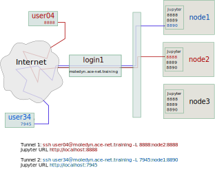

### Introduction
PYTRAJ is a Python front end to the AMBER [CPPTRAJ](https://amber-md.github.io/cpptraj/CPPTRAJ.xhtml) package. CPPTRAJ provides a variety of high level analysis commands, and at the same time it is suitable for batch processing. With PYTRAJ/CPPTRAJ you can do many operations on the raw MD trajectories. For example, convert among trajectory formats, process groups of trajectories generated with ensemble methods, image with periodic boundary conditions, create average structures, create subsets of the system. PYTRAJ is able to handle many files at the same time, and it can handle very large trajectories.

PYTRAJ offers more than 50 types of analyses such as RMS fitting, measuring distances, B-factors, radii of gyration, radial distribution functions, time correlations, and many more. PYTRAJ supports MPI, and usage of MPI is straightforward. You don't really need to understand deeply about MPI or write complicated code.

Other useful MD analysis software: [MDAnalysis](https://userguide.mdanalysis.org/stable/index.html), [MDTraj](https://mdtraj.org/),[Pteros](https://yesint.github.io/pteros/), [LOOS/PyLOOS](http://grossfieldlab.github.io/loos/index.htmland). These packages provide libraries that can be used to compose analysis programs. While this approach offers great flexibility, the learning curve is steep, and you will need to spend more time to master them.

References:  
1. [PTRAJ and CPPTRAJ: Software for Processing and Analysis of Molecular Dynamics Trajectory Data](https://pubs.acs.org/doi/full/10.1021/ct400341p)

### Using PYTRAJ in Jupyter notebook

The use of Jupyter notebook becomes increasingly popular for data analysis and visualization. One of the most attractive features of Jupyter is how well it combines different medium (your code, notes, and visualizations) in one solution. By keeping everything in one easy accessible place notebooks greatly simplify the management and sharing of your work.

Before going into details of MD analysis with PYTRAJ we need to create a python virtual environment. A virtual environment is a framework for management of multiple isolated Python environments. We use it on CC systems for installation of python packages in user accounts.

#### Installing Python Virtual Environment and Jupyter Notebook.
In this lesson we will be using PYTRAJ with AmberTools20. To start using these tools first you need to load modules required for AmberTools. Then load python and scipy-stack modules:

~~~
module load StdEnv/2020 gcc/9.3.0 openmpi/4.0.3 python scipy-stack
~~~
{: .bash}

The next step is to install and activate a virtual environment. We need a virtual environment because we will be installing python modules required for this lesson and virtual environment is the best way to install and manage python modules on CC systems.

~~~
virtualenv ~/env-pytraj
source ~/env-pytraj/bin/activate
~~~
{: .bash}

Once a virtual environment is installed and activated we can install Jupyter Notebook server. We begin installation by installing IPython kernel, the python backend for Jupyter Notebook. Kernel is a process that runs independently and interacts with the Jupyter Notebook server and its user interface. The Jupyter Notebook automatically ensures that the IPython kernel is available in the default environment. However, as we will be using Python in a specific virtual environment set up for using AmberTools, we need to install IPython kernel into the newly created environment. 

~~~
pip install --no-index jupyter ipykernel
~~~
{: .bash}

To make the environment *env-pytraj* accessible from notebook we need one more step: add the kernel specification for the new python to Jupyter. You can use any name for the kernel, for example 'env-pytraj'.

~~~
python -m ipykernel install --user --name=env-pytraj
~~~
{: .bash} 

Finally, install three more packages that we will be using: 
1. NGLview, a Jupyter widget for molecular visualization.
2. Pickle, a module providing functions for serialization of python objects (conversion into a byte stream). Objects need to be serialized for storage on a hard disk and loading back into python. 
3. Seaborn, a Python data visualization library extending a popular matplotlib. It provides a high-level interface for drawing, templates for attractive and informative statistical graphics.

~~~
pip install nglview pickle5 seaborn 
~~~
{: .bash}

As NGL viewer is a Jupyter notebook widget, we need to install and enable Jupyter widgets extension

~~~
jupyter nbextension install widgetsnbextension --py --sys-prefix 
jupyter-nbextension enable widgetsnbextension --py --sys-prefix
~~~
{: .bash}

The *nglview* python module provides NGLview Jupyter extension. We don't need to install it, but we need to enable it before it can be used:
~~~
jupyter-nbextension enable nglview --py --sys-prefix
~~~
{: .bash}

We are now ready to start Jupyter notebook server. The new Python kernel with the name `env-pytraj` will be available for notebooks.

#### Launching Jupyter notebook server
This example is for launching Jupyter on Graham. Procedure is the same on all other systems. the only difference is the name of the login and compute nodes. 

To make AmberTools available in a notebook we need to load ambertools module and activate the virtual environment before starting Jupyter server. As launching a server involves a sequence of several commands, it is convenient to save all commands in a file. You can later simply execute commands from this file (we call this "source file") instead of typing commands every time.

Let's create Jupyter startup file for use with AmberTools module, *jupyter_launch_ambertools.sh*, with the following content: 

~~~
#!/bin/bash
ml StdEnv/2020 gcc openmpi python scipy-stack ambertools
source $EBROOTAMBERTOOLS/amber.sh
source ~/env-pytraj/bin/activate
unset XDG_RUNTIME_DIR
jupyter notebook --ip $(hostname -f) --no-browser
~~~
{: .file-content}

Before starting jupyter server we need to allocate CPUs and RAM for our notebook. Let's request two MPI tasks because we will learn to how to analyze data in parallel. Submit request of an interactive resource allocation using the *salloc* command:

~~~
salloc --mem-per-cpu=2000 --time=2:0:0 --ntasks=2
~~~
{: .bash}

Wait for the allocation to complete. When it's done you will see that the command prompt changed:

~~~
salloc: Pending job allocation 44825307
salloc: job 44825307 queued and waiting for resources
salloc: job 44825307 has been allocated resources
salloc: Granted job allocation 44825307
salloc: Waiting for resource configuration
salloc: Nodes gra798 are ready for job
[svassili@gra798 ~]$ 
~~~
{:.output}

In this example salloc allocated the resources and logged you into the compute node gra798. Note the name of the node where notebook server will be running. Now we can start Jupyter server by executing commands from the file *jupyter_launch_ambertools.sh*

~~~
bash ./jupyter_launch_ambertools.sh
~~~
{: .bash}

Do not close this window, closing it will terminate the server. Note the port number (the default is 8888, but if you unintentionally start a second server, port number will be incremented). Note the notebook access token, you will need it to connect to the Jupyter notebook.

#### Connecting to Jupyter server

The message in the example above informs that notebook server is listening at port 8888 of the node gra798. Compute nodes cannot be accessed directly from the Internet, but we can connect to the login node, and the login node can connect any compute node. Thus, connection to a compute node should be also possible. How do we connect to the node gra798 at port 8888? We can instruct ssh client program to map port 8888 of gra798 to our local computer. This type of connection is called "ssh tunneling" or "ssh port forwarding". Ssh tunneling allows transporting networking data between computers over an encrypted SSH connection.

Open ANOTHER terminal tab or window and run the command:
~~~
ssh svassili@graham.computecanada.ca -L 8888:gra798:8888
~~~
{: .bash}

Replace the port number and the node name with the appropriate values.

This SSH session created tunnel from your computer to gra798. The tunnel will be active only while the session is running. Do not close this window and do not logout, this will close the tunnel and disconnect you from the notebook.

Now in the browser on your local computer you can type localhost:8888, and enter the token when prompted.

In Jupyter open new notebook. Ensure that you are creating notebook with the python kernel matching the active environment (env-pytraj), or kernel will fail to start!

> ## Uninstalling virtual environment from Jupyter:
>
> ~~~
> jupyter kernelspec list
> jupyter kernelspec uninstall env-pytraj
> ~~~
> {: .bash}
{: .callout}

### Computing RMSD 
We are now ready to use pytraj in Jupyter notebook. First load pytraj, numpy, and matplotlib modules. Then move into the directory where the input data files are located.

~~~
import pytraj as pt
import numpy as np
from matplotlib import pyplot as plt

%cd ~/scratch/Ago-RNA_sim/sim_pmemd/2-production/
~~~
{: .python}

Load the topology and the trajectory:

~~~
traj=pt.iterload('mdcrd', top = 'prmtop.parm7')
~~~
{: .python}

The `iterload` method can load multiple trajectories, supplied as a python list. You can also select slices from each of the trajectories, for example:

~~~
test=pt.iterload('mdcrd', top = 'prmtop.parm7', frame_slice=[(100, 110)]) 
~~~

will load only frames from 100 to 110 from mdcrd.

Other ways to select frames and atoms:

~~~
print(test)
print(test[-1]) # last frame
print(test[0:8])
print(test[0:8:2])
print(test[::2])
print(test[0:8:2, ':U'])
print(test[0:8:2, ':U@P'])
traj[8:2:-2, '!:WAT']
traj[8:2:-2, '!:WAT & !@H']
~~~
{: .python}

Load the reference frame
~~~
ref_crd = pt.load('../../inpcrd.pdb')
~~~
{: .python}

You can also use any trajectory frame, for example ref_crd = trj[0] as a reference structure.  

Before computing RMSD automatically center and image molecules/residues/atoms that are outside of the box back into the box.

~~~
traj=traj.autoimage()
~~~
{: .python}

Generate X-axis for RMSD plot. The trajectory was saved every 0.001 ns.
~~~
tstep = 0.001 
time = np.arange(0, traj.n_frames-1)*tstep
~~~
{: .python}

We want to compute RMSD for protein backbone atoms. To select these atoms we need to know the index numbers of protein residues. Protein comes first in the system, and to find the number of the last residue we can grep C-terminal oxygen:

~~~
!grep OXT ../../inpcrd.pdb 
~~~

Finally compute and plot RMSD: 

~~~
rmsd_data = pt.rmsd(traj, ref = ref_crd, nofit = False, mask = ':1-859@C,N,O')
plt.plot(time,rmsd_data)
plt.xlabel("Time, ns")
plt.ylabel("RMSD, Angstrom")
~~~
{: .python}

#### Parallel trajectory analysis using MPI

~~~
%cd ~/scratch/Ago-RNA_sim/sim_pmemd/2-production/
import numpy as np
import pickle
~~~
{: .python}

To process trajectory in parallel we need to create a python script file rmsd.py instead of entering commands in the notebook.  This script when executed with srun will use all available MPI tasks. Each task will process its share of frames and send the result to the master task. The master task will "pickle" the computed rmsd data and save it as a python object.   

To create the python script directly from the notebook we will use Jupyter magic command %%file.  

~~~
%%file rmsd.py

import pytraj as pt
import pickle
from mpi4py import MPI

comm = MPI.COMM_WORLD
rank = comm.rank

# load data files
traj = pt.iterload(['mdcrd'], top='prmtop.parm7')
ref_crd = pt.load('../../inpcrd.pdb')

# call pmap_mpi for MPI. We dont need to specify n_cores=x here since we will use srun.

data = pt.pmap_mpi(pt.rmsd, traj, mask=':1-859,@C,N,O', ref=ref_crd)

# computed RMSD data is sent to the master task (rank==0),
# and saved in the file rmsd.dat 
if rank == 0:
    print(data)
    with open("rmsd.dat", "wb") as fp: 
         pickle.dump(data, fp)
~~~
{: .python}

Run the script on the cluster. We will take advantage of the resources we have already allocated with salloc command and simply use srun without requesting anything:   

~~~
! srun python rmsd.py
~~~
{: .python}

In practice you will be submitting large analysis jobs to the queue with the sbatch command from a normal submission script requesting the desired number of MPI tasks (ntasks).

When the job is done we import the results saved in the file rmsd.dat into python and plot RMSD as we have done above:

~~~
with open("rmsd.dat", "rb") as fp: 
    rmsd=pickle.load(fp)
data=rmsd.get('RMSD_00001')
tstep=0.001
time=np.arange(0, len(data))*tstep

plt.plot(time,data)
plt.xlabel("Time, ns")
plt.ylabel("RMSD, Angstrom")
~~~
{: .python}

### Interactive trajectory visualization with NGLView

Data Visualization is one of the essential skills required to conduct a successful research involving molecular dynamics simulations. It allows you (or other people in the team) to better understand the nature of a process you are studying, and it gives you the ability to convey the proper message to a general audience in a publication. 

NGLView is a Jupyter widget for interactive viewing molecular structures and trajectories in notebooks. It runs in a browser and employs WebGL to display molecules like proteins and DNA/RNA with a variety of representations. It is also available as a standalone [Web application](http://nglviewer.org/ngl/).

Open a new notebook. Import pytraj, nglview and make sure you are in the right directory    

~~~
import pytraj as pt
import nglview as nv
%cd ~/scratch/Ago-RNA_sim/sim_pmemd/2-production/
~~~
{: .python}   

Load the trajectory:  

~~~
traj = pt.iterload('mdcrd', top = 'prmtop.parm7')
~~~
{: .python}

Automatically center and image molecules/residues/atoms that are outside of the box back into the box.  

~~~
traj = traj.autoimage()
~~~  
{: .python}

Strip water and ions

~~~
trj=traj.strip(':WAT, Na+, Cl-')
~~~  
{: .python}

Create NGLview widget 

~~~
view = nv.show_pytraj(trj)
~~~  
{: .python}

Delete the default representation

~~~
view.clear()
~~~  
{: .python}

Add protein cartoon representation

~~~
view.add_cartoon('protein', colorScheme="residueindex", opacity=1.0)
~~~  
{: .python}

Render the view. Try interacting with the viewer using [Mouse](http://nglviewer.org/ngl/api/manual/interaction-controls.html#mouse) and [Keyboard](http://nglviewer.org/ngl/api/manual/interaction-controls.html#keyboard) controls.

~~~
view 
~~~  
{: .python}

Add more representations. You can find samples of all representations [here](http://proteinformatics.charite.de/ngl/doc/#User_manual/Usage/Molecular_representations). 

Try using different [coloring schemes](https://nglviewer.org/ngl/api/manual/usage/coloring.html).  

Try visualizing different  selections. Selection language is described [here](https://nglviewer.org/ngl/api/manual/usage/selection-language.html)

~~~
view.add_licorice('protein', opacity=0.3)
view.add_hyperball(':B and not hydrogen', colorScheme="element")
view.add_hyperball(':C and not hydrogen', colorScheme="element")
view.add_spacefill('MG',colorScheme='element')
~~~  
{: .python}

Change background color

~~~
view.background="black"
~~~  
{: .python}

Change animation speed and step

~~~
view.player.parameters = dict(delay=0.5, step=1)
~~~  
{: .python}

Try changing display projection

~~~
view.camera='orthographic'
~~~  
{: .python}

Make animation smoother

~~~
view.player.interpolate = True
~~~  
{: .python}

Set size of the widget programmatically

~~~
view._remote_call('setSize', target='Widget', args=['700px', '400px'])
~~~  
{: .python}

Remove cartoon representation

~~~
view.remove_cartoon()
~~~  
{: .python}

Select all residues within a distance of residue 10

~~~
trj=traj[:10<:5]
~~~
{: .python}

Turn on GUI

~~~
view.display(gui=True)
~~~
{: .python}

#### Useful links

- AMBER/pytraj  
  - [Atom mask selection](https://amber-md.github.io/pytraj/latest/atom_mask_selection.html#atom-selections)

- NGL viewer 
  - [Documentation](http://nglviewer.org/nglview/latest/)
  - [Coloring schemes](https://nglviewer.org/ngl/api/manual/usage/coloring.html)
  - [Molecular representations](http://proteinformatics.charite.de/ngl/doc/#User_manual/Usage/Molecular_representations)
  - [Selection language](https://nglviewer.org/ngl/api/manual/usage/selection-language.html)
  - [Index](http://nglviewer.org/nglview/latest/genindex.html)
  - [Tutorial](https://ambermd.org/tutorials/analysis/tutorial_notebooks/nglview_notebook/index.html)
- Color maps
  - [Matplotlib](https://matplotlib.org/3.1.0/tutorials/colors/colormaps.html) 
  - [Seaborn](https://seaborn.pydata.org/tutorial/color_palettes.html)

#### References

1. [NGL viewer: web-based molecular graphics for large complexes](https://academic.oup.com/bioinformatics/article/34/21/3755/5021685)

### Principal component analysis
Nucleic backbone: :@O3',C3',C4',C5',O5',P

### Cross-correlation analysis. Compare windows of 200 ps. pytraj-atomiccorr
[Dynamical cross-correlation matrices](https://pubmed.ncbi.nlm.nih.gov/7563068/)

#### Jupyter Hub challenges

Bash variables can be set for a running python kernel from notebook:

~~~
import os
import envbash
amber_vars=os.path.join(os.environ.get("EBROOTAMBERTOOLS"), "amber.sh")
envbash.load_envbash(amber_vars)
~~~
{: .python}

I can't append to PYTHONPATH of a running kernel from a notebook?
I have not figured out how to load modules and set up environment variables for a python kernel running in Jupyter Hub.
