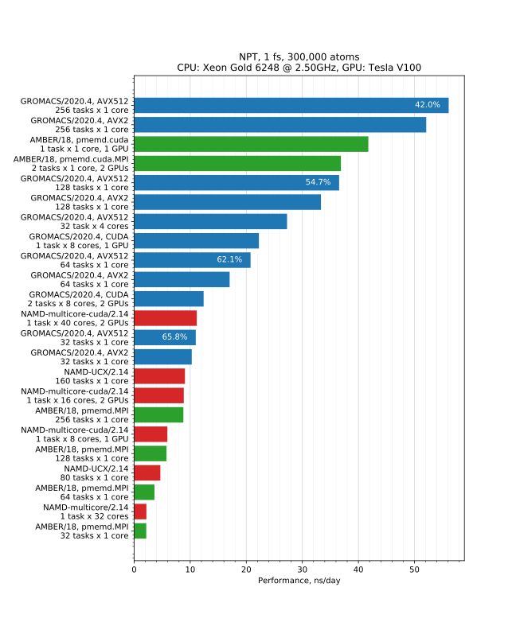

Requesting the right computational resources is essential for fast and efficient simulations. Submitting a simulation with more CPUs does not necessarily mean that it will run faster. In some cases, a simulation will run slower with more CPUs. There is also a choice between using CPU or GPU versions. When deciding on the number of CPUs, it is crucial to consider both simulation speed and CPU efficiency. If CPU efficiency is low, you will be wasting resources. This will negatively impact your priority, and as a result, you will not be able to run as many jobs as you would if you used CPUs more efficiently. To assess CPU efficiency, you need to know how fast a serial simulation runs and then compare the expected 100% efficient speedup (speed on 1CPU x N) with the actual speedup on N CPUs.

Below are the benchmark results comparing simulations of the same system with several MD packages. These results may give you valuable insight into how fast and efficient you can expect your simulation to run with different packages/resources.

The numbers printed on the bars show CPU efficiency.

## Submission scripts for running the benchmarks.
### GROMACS
Extend simulation for 10000 steps
~~~
gmx convert-tpr -s topol.tpr -nsteps 10000 -o next.tpr
~~~
{: .bash}

#### Submission script for a CPU simulation
~~~
#SBATCH --mem-per-cpu=4000 --time=10:0:0 -c4 --ntasks=2

module load StdEnv/2020 gcc/9.3.0 openmpi/4.0.3 gromacs
export OMP_NUM_THREADS="${SLURM_CPUS_PER_TASK:-1}"

srun gmx mdrun -s next.tpr -cpi state.cpt
~~~
{: .file-content}

#### Submission script for a GPU simulation (on Siku)
~~~
#SBATCH --mem-per-cpu=4000 --time=10:0:0 -c8 --ntasks=2
#SBATCH --gres=gpu:v100:2 --partition=all_gpus

module load StdEnv/2020 gcc/9.3.0 cuda/11.0 openmpi/4.0.3 gromacs
export OMP_NUM_THREADS="${SLURM_CPUS_PER_TASK:-1}"

srun gmx mdrun -s next.tpr -cpi state.cpt
~~~
{: .file-content}

### PMEMD
#### Submission script for a single GPU simulation (on Siku)
~~~
#SBATCH --mem-per-cpu=4000 --time=3:0:0
#SBATCH --gres=gpu:v100:1 --partition=all_gpus

module load nixpkgs/16.09 gcc/7.3.0 cuda/9.2.148\
 openmpi/3.1.2 amber/18.10-18.11

pmemd.cuda -O -i pmemd_prod.in -o production.log\
 -p ../../prmtop.parm7 -c restart.rst7
~~~
{: .file-content}

#### Submission script for a multiple GPU simulation (on Siku)
Multiple GPU pmemd version is meant to be used only for AMBER methods running multiple simulations, such as replica exchange. A single simulation does not scale boyond 1 GPU.
~~~
#SBATCH --mem-per-cpu=4000 --time=3:0:0  --ntasks=2
#SBATCH --gres=gpu:v100:2 --partition=all_gpus

module load nixpkgs/16.09  gcc/7.3.0  cuda/9.2.148\
 openmpi/3.1.2 amber/18.10-18.11

srun pmemd.cuda.MPI -O -i pmemd_prod.in -o production.log\
 -p ../../prmtop.parm7 -c restart.rst7
~~~
{: .file-content}

### NAMD
#### Submission script for a GPU simulation (on Siku)
~~~
#!/bin/bash
#SBATCH --time=2:0:0 --mem-per-cpu=2000 
#SBATCH -c16 --gres=gpu:v100:2 --partition=all_gpus

ml StdEnv/2020 cuda/11.0 namd-multicore/2.14
namd2 +p${SLURM_CPUS_PER_TASK} +idlepoll heating.in
~~~

### How to make your simulation run faster?
It is possible to increase time step to 4 fs with hydrogen mass repartitioning. The idea is that hydrogen masses are increased and at the same time masses of the atoms to which these hydrogens are bonded are decreased to keep the total mass constant. Hydrogen masses can be automatically repartitioned with the *parmed* program.
~~~
module --force purge
module load StdEnv/2020 gcc ambertools python scipy-stack
source $EBROOTAMBERTOOLS/amber.sh
parmed prmtop.parm7
~~~
{: .bash}

~~~
ParmEd: a Parameter file Editor

Loaded Amber topology file prmtop.parm7
Reading input from STDIN...
~~~
{: .output}

~~~
> hmassrepartition
> outparm prmtop_hmass.parm7
> quit
~~~
{: .bash}

References:  
1.[Lessons learned from comparing molecular dynamics engines on the SAMPL5 dataset](https://link.springer.com/article/10.1007%2Fs10822-016-9977-1)   
2.[Delivering up to 9X the Throughput with NAMD v3 and NVIDIA A100 GPU](https://developer.nvidia.com/blog/  delivering-up-to-9x-throughput-with-namd-v3-and-a100-gpu/)  
3.[AMBER GPU Docs](https://ambermd.org/GPUHowTo.php)  
4.[Long-Time-Step Molecular Dynamics through Hydrogen Mass Repartitioning](https://pubs.acs.org/doi/abs/10.1021/ct5010406)
